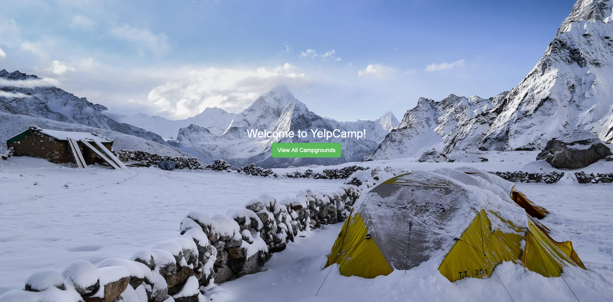
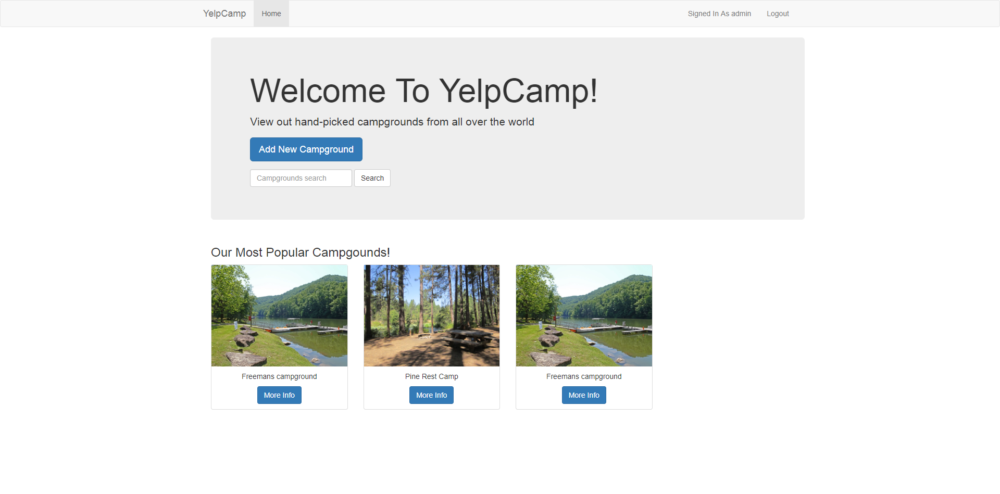
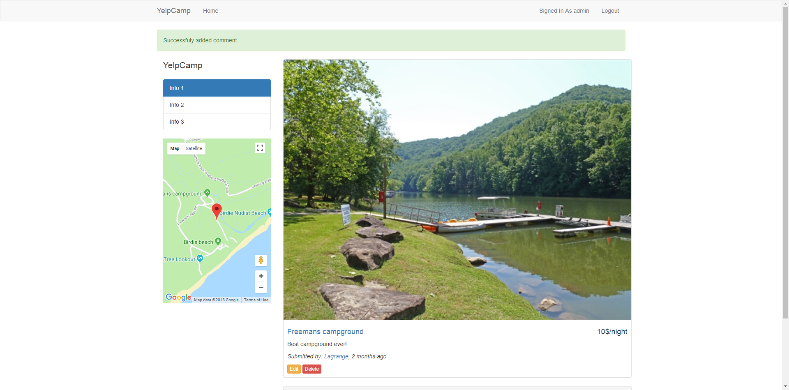
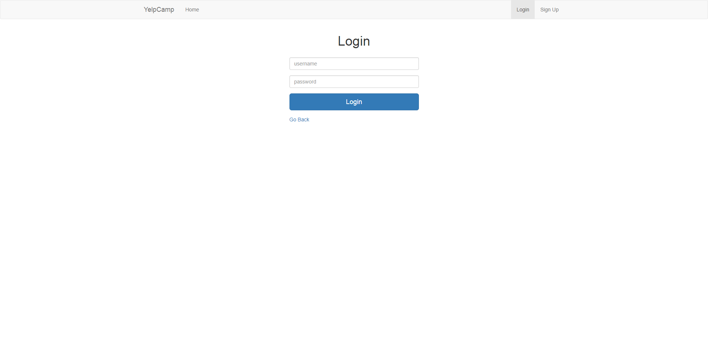
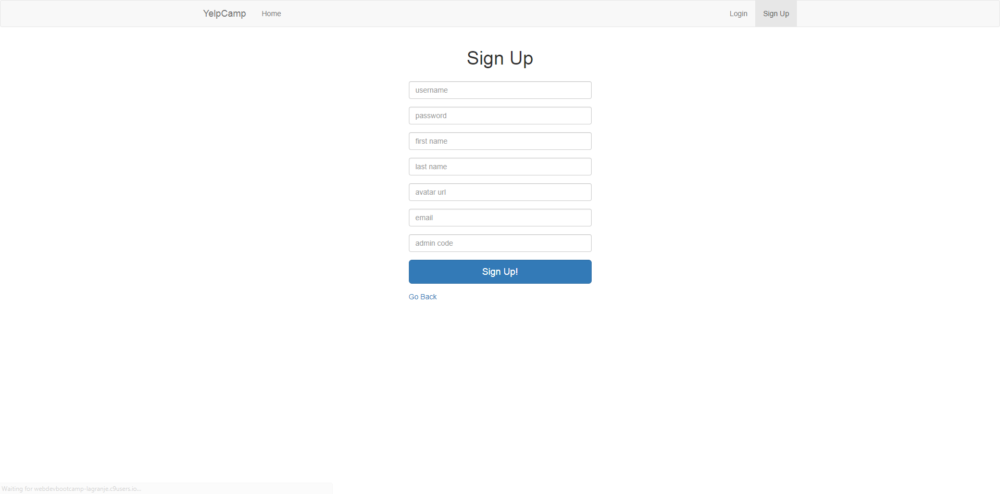
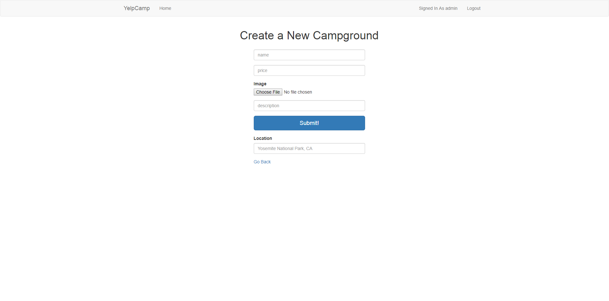

# YelpCamp - web application, where tourists can store and share information about campgrounds
## Application has the following parts:
### Animated Landing Page

Using pure css for bakcground animations
### Home page

### Campgorund show page

### Login page

### SignUp page

### Adding new campground page

## Technology stack
HTML, CSS, Bootstrap, EJS and Google Maps API on client side 
Express.js, RESTful routes, passport.js and MongoDB on server side 

### Try it out
https://webdevbootcamp-lagranje.c9users.io/campgrounds
